# Database Schema & ER Diagram — Stupendous LMS

> **Generated:** 2026-08-15 17:41 IST · **Updated:** 2026-08-15 19:12 IST (added `CouponRedemption`; `SiteSettings` gained white-label `logo`/`tagline`, default brand renamed to Stupendous LMS — migration `core/0006`)
> **Source of truth:** Django ORM `models.py` files across all backend apps (`core`, `courses`, `quizzes`, `activity`, `certificates`, `discussions`, `files`, `notifications`, `media_config`).
> **Engine:** Configurable via `DB_ENGINE` env — defaults to SQLite (`db.sqlite3`); PostgreSQL settings activate when `'postgresql' in DB_ENGINE` (`backend/lms_project/settings.py:99-112`). All constraints below are engine-agnostic (enforced by Django ORM, which creates them in DDL via migrations).
> **Auth:** Custom `User` (`AUTH_USER_MODEL = core.User`) extending Django's `AbstractUser`.

---

## 1. ER Diagram (Mermaid)

```mermaid
erDiagram
    USER ||--o{ COURSE : "creates (instructor)"
    CATEGORY ||--o{ COURSE : "classifies (SET_NULL)"
    COURSE ||--o{ CHAPTER : "contains (CASCADE)"
    CHAPTER ||--o{ CHAPTER : "prerequisite (SET_NULL, self-ref)"
    COURSE ||--o{ LESSON : "contains (CASCADE)"
    CHAPTER ||--o{ LESSON : "groups (SET_NULL, optional)"
    USER ||--o{ ENROLLMENT : "enrolls as student (CASCADE)"
    COURSE ||--o{ ENROLLMENT : "has (CASCADE)"
    USER ||--o{ PROGRESS : "tracks (CASCADE)"
    LESSON ||--o{ PROGRESS : "tracked by (CASCADE)"
    COURSE ||--o{ QUIZ : "assesses (CASCADE)"
    LESSON ||--o{ QUIZ : "attached to (CASCADE, optional)"
    QUIZ ||--o{ QUESTION : "contains (CASCADE, nullable)"
    USER ||--o{ QUESTION : "created_by (CASCADE)"
    COURSE ||--o{ QUESTION : "question bank (CASCADE, nullable)"
    QUESTION ||--o{ QUESTION_OPTION : "has options (CASCADE)"
    QUIZ ||--o{ QUIZ_ATTEMPT : "attempted via (CASCADE)"
    USER ||--o{ QUIZ_ATTEMPT : "attempts (CASCADE)"
    QUIZ_ATTEMPT ||--o{ QUIZ_ANSWER : "contains (CASCADE)"
    QUESTION ||--o{ QUIZ_ANSWER : "answered by (CASCADE)"
    QUESTION_OPTION |o--o{ QUIZ_ANSWER : "selected (CASCADE, optional)"
    USER ||--o{ CERTIFICATE : "earns (CASCADE)"
    COURSE ||--o{ CERTIFICATE : "issues (CASCADE)"
    COURSE ||--o{ DISCUSSION_THREAD : "hosts (CASCADE)"
    USER ||--o{ DISCUSSION_THREAD : "authors (CASCADE)"
    DISCUSSION_THREAD ||--o{ DISCUSSION_REPLY : "has (CASCADE)"
    USER ||--o{ DISCUSSION_REPLY : "authors (CASCADE)"
    USER ||--o{ NOTIFICATION : "receives (CASCADE)"
    COURSE |o--o{ NOTIFICATION : "about (CASCADE, optional)"
    USER |o--o{ NOTIFICATION : "about (CASCADE, optional)"
    USER ||--o{ UPLOADED_FILE : "uploads (CASCADE)"
    COURSE |o--o{ UPLOADED_FILE : "for (CASCADE, optional)"
    LESSON |o--o{ UPLOADED_FILE : "for (CASCADE, optional)"
    USER |o--o{ ACTIVITY_LOG : "performs (CASCADE, nullable)"
    USER ||--o{ SESSION_ACTIVITY : "has (CASCADE)"
    USER ||--o{ LESSON_TIME_TRACKING : "watches (CASCADE)"
    LESSON ||--o{ LESSON_TIME_TRACKING : "viewed in (CASCADE)"
    USER ||--o{ DAILY_ACTIVITY_SUMMARY : "summarized (CASCADE)"
    COUPON ||--o{ COUPON_REDEMPTION : "redeemed via (CASCADE)"
    USER ||--o{ COUPON_REDEMPTION : "redeems (CASCADE)"
    COURSE |o--o{ COUPON_REDEMPTION : "against (SET_NULL, optional)"
    CONTENT_TYPE |o--o{ ACTIVITY_LOG : "generic target (CASCADE, optional)"

    USER {
        int id PK
        varchar username UK
        varchar email
        bool is_student "role flag, default false"
        bool is_instructor "role flag, default false"
        bool is_staff "inherited from AbstractUser"
        bool is_superuser "inherited from AbstractUser"
        varchar avatar "ImageField, nullable"
        text bio "max 500, nullable"
        varchar phone "max 20, nullable"
        varchar location "max 100, nullable"
        varchar website "URL, nullable"
        json notification_preferences "default {}"
        text expertise "trainer skill list, nullable"
        varchar preferred_language "max 5, default en"
        datetime date_joined "inherited"
        datetime created_at "default now"
        datetime updated_at "auto_now"
    }
    SITE_SETTINGS {
        int id PK "always 1 (singleton)"
        varchar email_backend "default console"
        varchar email_host "default smtp.gmail.com"
        int email_port "default 587"
        bool email_use_tls "default true"
        bool email_use_ssl "default false"
        varchar email_host_user "blank ok"
        varchar email_host_password "blank ok"
        varchar default_from_email
        varchar site_name "default Stupendous LMS"
        imagefile logo "branding/, nullable (white-label)"
        varchar tagline "max 200, blank ok"
        varchar site_url "frontend URL"
        datetime created_at "auto_now_add"
        datetime updated_at "auto_now"
    }
    CATEGORY {
        int id PK
        varchar name UK "max 100"
        varchar slug UK "max 100"
        text description "blank ok"
        datetime created_at "auto_now_add"
    }
    COURSE {
        int id PK
        varchar title "max 200"
        text description
        int instructor_id FK
        int category_id FK "nullable, SET_NULL"
        varchar level "Beginner|Intermediate|Advanced"
        varchar thumbnail "ImageField, nullable"
        varchar status "draft|published|archived"
        decimal price "10,2, default 0.00"
        decimal original_price "10,2, nullable"
        bool is_free "default false"
        datetime created_at "auto_now_add"
        datetime updated_at "auto_now"
        datetime published_at "nullable"
    }
    CHAPTER {
        int id PK
        int course_id FK
        varchar title "max 200"
        text description "blank ok"
        int order "unique per course"
        bool is_locked "default false"
        int prerequisite_chapter_id FK "self, nullable, SET_NULL"
        datetime created_at "auto_now_add"
        datetime updated_at "auto_now"
    }
    LESSON {
        int id PK
        int course_id FK
        int chapter_id FK "nullable, SET_NULL"
        varchar title "max 200"
        varchar video_url "URL, nullable"
        varchar video_file "FileField lesson_videos/, nullable"
        int duration "minutes, nullable"
        int order "PositiveInteger, no unique"
        text content "blank ok"
    }
    ENROLLMENT {
        int id PK
        int student_id FK "unique with course"
        int course_id FK "unique with student"
        datetime enrolled_at "auto_now_add"
    }
    PROGRESS {
        int id PK
        int student_id FK "unique with lesson"
        int lesson_id FK "unique with student"
        bool completed "default false"
        datetime completed_at "set on first completion"
    }
    COUPON {
        int id PK
        varchar code UK "max 50"
        text description "blank ok"
        int discount_percentage "0-100"
        bool is_active "default true"
        int max_uses "nullable = unlimited"
        int times_used "default 0"
        datetime valid_from "default now"
        datetime valid_until "nullable = never expires"
        datetime created_at "auto_now_add"
        datetime updated_at "auto_now"
    }
    COUPON_REDEMPTION {
        int id PK
        int coupon_id FK "unique with user"
        int user_id FK "unique with coupon"
        int course_id FK "nullable, SET_NULL"
        datetime redeemed_at "auto_now_add"
    }
    QUIZ {
        int id PK
        int course_id FK
        int lesson_id FK "nullable"
        varchar title "max 200"
        text description "blank ok"
        int passing_score "0-100 pct, default 70"
        int time_limit "minutes, nullable = unlimited"
        int max_attempts "default 3, min 1"
        bool is_active "default true"
        datetime created_at "auto_now_add"
        datetime updated_at "auto_now"
    }
    QUESTION {
        int id PK
        int quiz_id FK "nullable = in bank"
        text question_text
        varchar question_type "mc|true_false|short_answer"
        int points "min 1, default 1"
        int order "default 0"
        text explanation "shown post-answer"
        int created_by_id FK
        int course_id FK "nullable, bank scope"
        bool is_in_bank "true = unassigned"
        datetime created_at "auto_now_add"
        datetime updated_at "auto_now"
    }
    QUESTION_OPTION {
        int id PK
        int question_id FK
        varchar option_text "max 500"
        bool is_correct "default false"
        int order "default 0"
    }
    QUIZ_ATTEMPT {
        int id PK
        int quiz_id FK
        int student_id FK
        decimal score "5,2, nullable"
        int max_score "default 0"
        decimal percentage "5,2, nullable"
        bool passed "default false"
        int attempt_number "sequential per student+quiz"
        datetime started_at "auto_now_add"
        datetime completed_at "nullable"
        int time_taken "seconds, nullable"
    }
    QUIZ_ANSWER {
        int id PK
        int attempt_id FK "unique with question"
        int question_id FK "unique with attempt"
        int selected_option_id FK "nullable"
        text text_answer "for short_answer"
        bool is_correct "default false"
        int points_earned "default 0"
    }
    CERTIFICATE {
        int id PK
        uuid certificate_id UK "uuid4, immutable"
        int student_id FK "unique with course"
        int course_id FK "unique with student"
        datetime issued_at "auto_now_add"
        date completion_date "auto_now_add"
        varchar student_name "snapshot max 200"
        varchar course_title "snapshot max 200"
        varchar instructor_name "snapshot max 200"
        bool is_valid "default true"
        datetime revoked_at "nullable"
        text revoked_reason "blank ok"
    }
    DISCUSSION_THREAD {
        int id PK
        int course_id FK
        int author_id FK
        varchar title "max 200"
        text content
        bool is_pinned "default false"
        bool is_locked "default false"
        bool is_deleted "soft delete"
        datetime created_at "indexed"
        datetime updated_at "auto_now"
        datetime last_activity_at "indexed, bumped by replies"
    }
    DISCUSSION_REPLY {
        int id PK
        int thread_id FK
        int author_id FK
        text content
        bool is_solution "instructor-marked"
        bool is_deleted "soft delete"
        datetime created_at "indexed"
        datetime updated_at "auto_now"
    }
    NOTIFICATION {
        int id PK
        int recipient_id FK
        varchar notification_type "5 types, max 50"
        varchar title "max 200"
        text message
        int related_course_id FK "nullable"
        int related_user_id FK "nullable"
        varchar link "max 500, blank ok"
        bool is_read "default false"
        datetime created_at "auto_now_add"
    }
    UPLOADED_FILE {
        int id PK
        varchar file "uploads/{type}/{user}/..."
        varchar file_type "thumbnail|video|avatar|document|other"
        varchar original_filename "max 255"
        int file_size "bytes"
        varchar mime_type "max 100, blank ok"
        int uploaded_by_id FK
        datetime uploaded_at "auto_now_add"
        int course_id FK "nullable"
        int lesson_id FK "nullable"
    }
    ACTIVITY_LOG {
        int id PK
        int user_id FK "nullable = anonymous"
        varchar action_type "max 50, indexed"
        datetime timestamp "default now, indexed"
        int content_type_id FK "nullable, generic"
        int object_id "nullable, generic target PK"
        text description "blank ok"
        json metadata "default {}"
        varchar session_key "max 40, indexed"
        varchar ip_address "nullable"
        text user_agent "blank ok"
    }
    SESSION_ACTIVITY {
        int id PK
        int user_id FK
        varchar session_key UK "max 40"
        datetime started_at "default now"
        datetime last_activity "default now"
        datetime ended_at "nullable"
        int page_views "default 0"
        int actions_count "default 0"
        varchar ip_address "nullable"
        text user_agent "blank ok"
        varchar device_type "desktop|mobile|tablet|unknown"
    }
    LESSON_TIME_TRACKING {
        int id PK
        int student_id FK "unique with lesson"
        int lesson_id FK "unique with student"
        datetime started_at "default now"
        int last_position "video seconds"
        int time_spent "total seconds"
        bool completed "default false"
        datetime completed_at "nullable"
        int pause_count "default 0"
        int replay_count "default 0"
    }
    DAILY_ACTIVITY_SUMMARY {
        int id PK
        int user_id FK "unique with date"
        date date "indexed"
        int login_count "default 0"
        int courses_viewed "default 0"
        int lessons_viewed "default 0"
        int lessons_completed "default 0"
        int total_time_spent "seconds"
        int engagement_score "0-100"
    }
    MEDIA_STORAGE_CONFIG {
        int id PK "always 1 (singleton)"
        varchar video_storage_type "local|s3|file_server"
        varchar video_local_path
        varchar video_file_server_url
        varchar video_file_server_username
        varchar video_file_server_password
        varchar video_s3_bucket
        varchar video_s3_region
        varchar video_s3_access_key
        varchar video_s3_secret_key
        varchar thumbnail_storage_type
        varchar thumbnail_local_path
        varchar thumbnail_file_server_url
        varchar thumbnail_s3_bucket
        varchar thumbnail_s3_region
        varchar avatar_storage_type
        varchar avatar_local_path
        varchar avatar_file_server_url
        varchar avatar_s3_bucket
        varchar avatar_s3_region
        bool enable_image_transcoding
        varchar image_output_format
        int image_quality
        int max_image_width
        int max_image_height
        bool strip_image_metadata
        int max_video_size_mb
        int max_image_size_mb
        datetime created_at "auto_now_add"
        datetime updated_at "auto_now"
    }
```

---

## 2. Relationship Catalog

Legend: **CASCADE** = child rows deleted with parent · **SET_NULL** = FK nulled, row survives (column must be nullable) · **PROTECT** = none used in this schema.

| # | Parent | Child | Cardinality | `on_delete` | Reverse accessor | Notes |
|---|--------|-------|-------------|-------------|------------------|-------|
| 1 | `User` | `Course` | 1 → 0..N | CASCADE | `courses_created` | Instructor ownership. Deleting a user destroys all their courses **and everything cascading beneath** (chapters, lessons, quizzes, enrollments, certificates, discussions). |
| 2 | `Category` | `Course` | 1 → 0..N | SET_NULL | `courses` | Deleting a category orphans courses with `category = NULL`; no data loss. |
| 3 | `Course` | `Chapter` | 1 → 0..N | CASCADE | `chapters` | Ordered via `order`, `unique_together (course, order)`. |
| 4 | `Chapter` | `Chapter` | 1 → 0..N | SET_NULL | `dependent_chapters` | **Self-referential prerequisite chain.** Deleting a prerequisite unlocks dependents (`prerequisite_chapter = NULL`). No cycle protection at DB/ORM level. |
| 5 | `Course` | `Lesson` | 1 → 0..N | CASCADE | `lessons` | Course is the *hard* parent. |
| 6 | `Chapter` | `Lesson` | 1 → 0..N | SET_NULL | `lessons` | Lesson may be chapter-less (`NULL`). ⚠️ No constraint that `chapter.course == course` — see Nuance N3. |
| 7 | `User` | `Enrollment` | 1 → 0..N | CASCADE | `enrollments` | `unique_together (student, course)` — one enrollment per student per course (DB-enforced). |
| 8 | `Course` | `Enrollment` | 1 → 0..N | CASCADE | `enrollments` | Deleting a course silently drops enrollment history. |
| 9 | `User` | `Progress` | 1 → 0..N | CASCADE | *(none — default `progress_set`)* | `unique_together (student, lesson)`. No `related_name`. |
| 10 | `Lesson` | `Progress` | 1 → 0..N | CASCADE | *(none)* | Deleting a lesson erases student progress for it. |
| 11 | `Course` | `Quiz` | 1 → 0..N | CASCADE | `quizzes` | Mandatory parent. |
| 12 | `Lesson` | `Quiz` | 1 → 0..N | CASCADE | `quizzes` | Optional; course-level quizzes have `lesson = NULL`. |
| 13 | `Quiz` | `Question` | 1 → 0..N | CASCADE (nullable FK) | `questions` | `NULL` quiz = question lives in the bank. |
| 14 | `User` | `Question` | 1 → 0..N | CASCADE | `questions_created` | Authoring instructor. |
| 15 | `Course` | `Question` | 1 → 0..N | CASCADE (nullable FK) | `question_bank` | Bank scoping per course. |
| 16 | `Question` | `QuestionOption` | 1 → 0..N | CASCADE | `options` | Options die with their question. |
| 17 | `Quiz` | `QuizAttempt` | 1 → 0..N | CASCADE | `attempts` | Multiple attempts per student allowed (`unique_together = []`). |
| 18 | `User` | `QuizAttempt` | 1 → 0..N | CASCADE | `quiz_attempts` | Gated by `quiz.max_attempts` in app logic only. |
| 19 | `QuizAttempt` | `QuizAnswer` | 1 → 0..N | CASCADE | `answers` | `unique_together (attempt, question)` — one answer per question per attempt. |
| 20 | `Question` | `QuizAnswer` | 1 → 0..N | CASCADE | *(none)* | |
| 21 | `QuestionOption` | `QuizAnswer` | 1 → 0..N | CASCADE (nullable FK) | *(none)* | `selected_option` NULL for `short_answer` type. |
| 22 | `User` | `Certificate` | 1 → 0..N | CASCADE | `certificates` | `unique_together (student, course)` — one certificate per completed course. |
| 23 | `Course` | `Certificate` | 1 → 0..N | CASCADE | `certificates` | |
| 24 | `Course` | `DiscussionThread` | 1 → 0..N | CASCADE | `discussion_threads` | |
| 25 | `User` | `DiscussionThread` | 1 → 0..N | CASCADE | `discussion_threads` | ⚠️ Name collision with #24's default — Django allows because one is explicit; both use `related_name='discussion_threads'` on *different* models. |
| 26 | `DiscussionThread` | `DiscussionReply` | 1 → 0..N | CASCADE | `replies` | |
| 27 | `User` | `DiscussionReply` | 1 → 0..N | CASCADE | `discussion_replies` | |
| 28 | `User` | `Notification` | 1 → 0..N | CASCADE | `notifications_received` | Recipient (trainer). |
| 29 | `Course` | `Notification` | 0..1 → 0..N | CASCADE (nullable) | `notifications` | |
| 30 | `User` | `Notification` | 0..1 → 0..N | CASCADE (nullable) | `notifications_about` | The student whose action triggered it. |
| 31 | `User` | `UploadedFile` | 1 → 0..N | CASCADE | `uploaded_files` | |
| 32 | `Course` | `UploadedFile` | 0..1 → 0..N | CASCADE (nullable) | `files` | |
| 33 | `Lesson` | `UploadedFile` | 0..1 → 0..N | CASCADE (nullable) | `files` | |
| 34 | `User` | `ActivityLog` | 0..1 → 0..N | CASCADE (nullable) | `activities` | NULL user = anonymous action. |
| 35 | `ContentType` (Django) | `ActivityLog` | 0..1 → 0..N | CASCADE (nullable) | — | **Generic FK** half; pairs with `object_id`. No referential integrity to the target row. |
| 36 | `User` | `SessionActivity` | 1 → 0..N | CASCADE | `sessions` | ⚠️ `related_name='sessions'` collides conceptually with Django's auth sessions; it shadows nothing but is confusing. `session_key` unique. |
| 37 | `User` | `LessonTimeTracking` | 1 → 0..N | CASCADE | `lesson_time_logs` | `unique_together (student, lesson)`. |
| 38 | `Lesson` | `LessonTimeTracking` | 1 → 0..N | CASCADE | `time_logs` | |
| 39 | `User` | `DailyActivitySummary` | 1 → 0..N | CASCADE | `daily_summaries` | `unique_together (user, date)`. |
| 40 | `Coupon` | `CouponRedemption` | 1 → 0..N | CASCADE | `redemptions` | `unique_together (coupon, user)` — one redemption per user per coupon, DB-enforced. |
| 41 | `User` | `CouponRedemption` | 1 → 0..N | CASCADE | `coupon_redemptions` | Redemption audit ledger. |
| 42 | `Course` | `CouponRedemption` | 0..1 → 0..N | SET_NULL (nullable) | `coupon_redemptions` | Records which course a coupon discounted; survives course deletion (SET_NULL). |

**Standalone tables (no FK relationships):** `SiteSettings` (singleton), `MediaStorageConfig` (singleton). (`Coupon` gained an outbound ledger via `CouponRedemption` in the 2026-08-15 working tree.) Plus Django-managed: `django_session`, `django_admin_log`, `django_content_type`, `auth_group`, `auth_permission`, `auth_group_permissions`, `core_user_groups`, `core_user_user_permissions`.

---

## 3. Entity Nuances

### 3.1 `User` (core)
- Extends `AbstractUser` — inherits `username`, `email`, `password` (hashed), `is_active`, `is_staff`, `is_superuser`, `date_joined`, `last_login`, plus M2M `groups` / `user_permissions`.
- **Roles are independent boolean flags** (`is_student`, `is_instructor`), both default `False`. No exclusivity constraint — a user can be student *and* instructor, or **neither** (e.g., plain admin). Role checks in views must handle overlaps.
- `created_at` uses `default=timezone.now` (set at instantiation, not save); `updated_at` uses `auto_now=True`.
- `preferred_language` (max 5) drives the video-player UI/captions; 20 languages including 10 Indian languages.
- `notification_preferences` JSON — schemaless, app-interpreted.
- Duplicated timestamp pair: `date_joined` (inherited) ≈ `created_at` (custom); ordering uses `date_joined`.

### 3.2 `SiteSettings` / `MediaStorageConfig` (singletons)
- Both force `pk = 1` in `save()`; `SiteSettings.delete()` is a **no-op** (cannot be deleted), `MediaStorageConfig` relies on `get_config()` (`get_or_create(pk=1)`).
- ⚠️ `SiteSettings` stores SMTP password and `MediaStorageConfig` stores S3 credentials / file-server password as **plain CharFields** — not encrypted at rest; DB backups leak credentials.
- Not relational; included in diagram for completeness.

### 3.3 `Course`
- Lifecycle FSM: `draft` → `published` → `archived`, enforced only by `publish()` / `unpublish()` helpers, not DB constraints. `published_at` stamped on first publish only (set when status flips; `unpublish()` does **not** clear it).
- Pricing triple: `price` (default 0.00), `original_price` (nullable, for showing strikethrough), `is_free`. ⚠️ `is_free` is independent of `price` — a course can be `is_free=True` with `price=999`; display logic must decide precedence.
- Deleting an instructor (User CASCADE) destroys all their courses and the entire subtree.

### 3.4 `Chapter`
- `unique_together (course, order)` — reordering requires swap-safe updates (Django `bulk_update` or F-expressions) or the swap will transiently violate uniqueness.
- Prerequisite gating (`is_unlocked_for_student`) is **evaluated at read time** from `Progress` rows — a locked chapter with no prerequisite chapter, or whose prerequisite has zero lessons, is always unlocked.
- ⚠️ No cycle prevention in the self-referential `prerequisite_chapter` chain.

### 3.5 `Lesson`
- **Dual parentage**: both `course` (CASCADE, mandatory) and `chapter` (SET_NULL, optional). ⚠️ Nothing guarantees `chapter.course_id == course_id` — an admin can attach a lesson to another course's chapter; reads via `chapter.lessons` vs `course.lessons` then disagree. (Both relations populated by app code.)
- `order` is `PositiveIntegerField` with **no uniqueness** (unlike Chapter) — duplicate order values sort ambiguously.
- Two video sources, `video_url` (e.g., YouTube embed) and `video_file` (local upload to `lesson_videos/`) — player must prefer one; no constraint that at least one is present.
- No timestamps (`created_at`/`updated_at` absent).

### 3.6 `Enrollment`
- Pure join table with `unique_together (student, course)`; `enrolled_at` set once (`auto_now_add`).
- Cascade from either side wipes history: unenroll-by-deletion of course or user removes the record permanently (no soft delete).

### 3.7 `Progress`
- One row per (student, lesson) max. `save()` stamps `completed_at` **only on the first transition** to `completed=True` (`if self.completed and not self.completed_at`) — un-completing then re-completing keeps the original timestamp.
- ⚠️ No FK to `Enrollment` and no validation that the student is enrolled in the lesson's course — progress rows can exist for un-enrolled students (the API enforces it, the DB does not).
- `related_name` absent on both FKs → reverse accessors are `progress_set` from both `User` and `Lesson`.

### 3.8 `Coupon`
- ~~No FK relationships — `times_used` race~~ **Fixed in working tree (2026-08-15, uncommitted):** `use_coupon()` read-modify-write replaced by `redeem(user)` — `select_for_update()` row lock + `CouponRedemption` ledger with `unique_together (coupon, user)` + atomic `F('times_used') + 1` update. Concurrent over-redemption past `max_uses` and repeat redemption per user are now both prevented (needs PostgreSQL/`select_for_update` support; SQLite ignores row locks but serializes writes anyway).
- `apply_to(price)` computes the discounted price server-side (`Decimal`, `ROUND_HALF_UP`, floored at 0.00) — clients never compute totals.
- The ledger records which user redeemed which coupon on which course (`course` SET_NULL) — auditable against revenue.
- Validity (`is_valid()`) is app-level: `is_active` ∧ now ≥ `valid_from` ∧ (`valid_until` null ∨ now ≤ `valid_until`) ∧ (`max_uses` null ∨ `times_used < max_uses`).
- ⚠️ **No `Payment`/`Order`/`Transaction` model exists anywhere in the schema** — checkout (coupon validation + UPI flow per `frontend/tests/helpers/upi-payment-helper.js`) is not persisted server-side; there is no DB record of a purchase.

### 3.9 `Quiz` / `Question` / `QuestionOption`
- `Quiz.lesson` nullable: lesson-scoped or course-scoped quizzes.
- `passing_score` is a **percentage** (0–100, default 70), compared against `QuizAttempt.percentage`.
- `time_limit` in minutes, NULL = untimed. `max_attempts` min 1, default 3 — but enforcement is app-level; DB allows unlimited `QuizAttempt` rows.
- **Question bank pattern**: `Question.quiz` nullable + `is_in_bank` boolean + separate `course` FK. A question simultaneously carries up to three course references (`quiz.course`, own `course`, `created_by`'s courses) which can disagree. `is_in_bank` is meant to mirror `quiz IS NULL` but is **not kept consistent by the DB**.
- `true_false` questions still use `QuestionOption` rows (two options) — grading path is identical to multiple choice.
- Ordering: `Question.Meta.ordering = ['quiz', 'order']` — NULL quiz sorts first on most engines, last on others (engine-dependent).

### 3.10 `QuizAttempt` / `QuizAnswer`
- Retakes allowed: `unique_together = []`; `attempt_number` is an app-maintained sequence per (student, quiz), not DB-enforced (no unique constraint on it).
- `calculate_score()` recomputes from `answers`: `percentage = earned/total × 100`; division-by-zero guarded (`total_points > 0` else 0). `passed = percentage >= quiz.passing_score`.
- `QuizAnswer.selected_option` nullable for `short_answer`; `text_answer` holds free text. **Short-answer grading is manual** — `check_answer()` grades only `multiple_choice` and `true_false`; a short answer stays `is_correct=False`/`points_earned=0` until a human edits it, so `calculate_score()` runs prematurely will understate scores.
- `unique_together (attempt, question)` prevents duplicate answers within an attempt.

### 3.11 `Certificate`
- `certificate_id` UUID4, unique, non-editable — public verification token (`/api/certificates/verify/?certificateId=...`).
- **Denormalized snapshot fields** (`student_name`, `course_title`, `instructor_name`) frozen at issue time — survives later renames/deletes (intentional historical record).
- `unique_together (student, course)` — but CASCADE delete on either FK means **deleting the user or course deletes the certificate**, contradicting the snapshot intent; revocation (`is_valid=False`, `revoked_at`, `revoked_reason`) is the soft path instead of deletion.
- `issued_at` (datetime) and `completion_date` (date) are both `auto_now_add` — they record issuance time, not actual course completion time.

### 3.12 `DiscussionThread` / `DiscussionReply`
- **Soft delete** via `is_deleted` on both; hard CASCADE still applies to user/course deletion.
- Thread ordering: pinned first, then most recent activity (`ordering = ['-is_pinned', '-last_activity_at']`, backed by composite index `(course, -last_activity_at)`).
- `DiscussionReply.save()` side-effect: bumps parent thread's `last_activity_at` to the reply's `created_at` (extra UPDATE per reply; also fires on edits since `save()` is not create-scoped).
- `is_locked` blocks new replies (app-enforced); `is_solution` marks instructor-accepted answer on replies.
- ⚠️ Both FKs (#24, #25) declare `related_name='discussion_threads'` — legal because they're on different target models (`Course.discussion_threads` and `User.discussion_threads`), but easy to misread.

### 3.13 `Notification`
- Denormalized message: `title`, `message`, `link` copied in, so deleting the related course/user leaves a readable (if dangling-link) notification — except the FKs themselves CASCADE, so the row dies with the course anyway.
- Indexes: `(recipient, is_read)` for unread-badge queries, `created_at`.
- Five trainer-facing types: `discussion_post`, `assessment_submission`, `course_completion`, `new_enrollment`, `student_question`.
- No "read_at" timestamp — only boolean `is_read`.

### 3.14 `UploadedFile`
- Upload path computed by `upload_to_path()`: `uploads/{file_type}/{user_id}/{filename}` — relies on `instance.uploaded_by.id` existing (unsaved-user crash risk in `upload_to`).
- `delete()` overridden to remove the physical file from disk first — bypassed on `QuerySet.delete()` / cascade bulk deletes (files orphaned).
- Optional course/lesson links; CASCADE on both, so course/lesson deletion deletes file *records* (and with the override caveat above, may leave blobs on disk).

### 3.15 Activity-tracking suite (`activity` app)
- **`ActivityLog`** uses a **GenericForeignKey** (`content_type` + `object_id`): can point at any row of any table. Consequences: no referential integrity (dangling references after target deletion, since ContentType CASCADE only covers the type row), and no DB-level join — queries are per-object `content_type` + `object_id` lookups (indexed as a composite). 25 action types spanning auth, course, lesson, quiz, discussion, certificate, and general actions. `user` nullable for anonymous events. `metadata` JSON for arbitrary payloads.
- **`SessionActivity`**: one row per `session_key` (unique, 40 chars — Django session key size). Duration computed (`ended_at or last_activity`) minus `started_at`; device_type derived from user agent. ⚠️ `related_name='sessions'` on User shadows nothing but invites confusion with `django_session`.
- **`LessonTimeTracking`**: unique per (student, lesson); `last_position` enables video resume; `pause_count`/`replay_count` engagement metrics; `mark_complete()` idempotent. ⚠️ **Duplicates `Progress` as a completion source of truth** — both carry `completed`/`completed_at` for the same (student, lesson) with no sync between them; reports must pick one (they can disagree).
- **`DailyActivitySummary`**: pre-aggregated rollup per (user, date); `engagement_score` 0–100; generated by management command / celery — never write it from request paths.

---

## 4. Cross-cutting Observations

1. **Delete-happy schema**: no PROTECT anywhere. Deleting a `User` nukes courses, quizzes, certificates, discussions, activity history in one cascade. For an LMS with financial/audit implications, certificates and activity logs arguably should PROTECT or be soft-deleted.
2. **Two completion truths**: `Progress` and `LessonTimeTracking` both track lesson completion independently (Nuance 3.15).
3. **Lesson's dual-parent integrity gap** (Nuance 3.5).
4. **Coupon concurrency + redemption ledger: fixed in working tree; no payment persistence still true** — no `Order`/`Payment` model exists; checkout of partial discounts returns HTTP 402 pending a gateway (Nuance 3.8).
5. **Soft deletes only in discussions** — everywhere else deletion is final.
6. **App-enforced constraints** (not in DB): quiz `max_attempts`, chapter lock gating, coupon validity, enrollment-before-progress, `is_in_bank` ↔ `quiz IS NULL` consistency.
7. **JSON columns** (`User.notification_preferences`, `ActivityLog.metadata`) — unqueryable/unindexed in SQLite; fine on PostgreSQL with `GIN` if added.

---

*End of document — regenerate after any migration by re-reading `backend/*/models.py`.*
